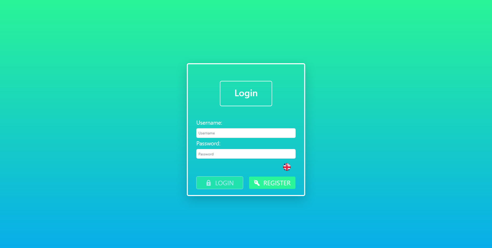
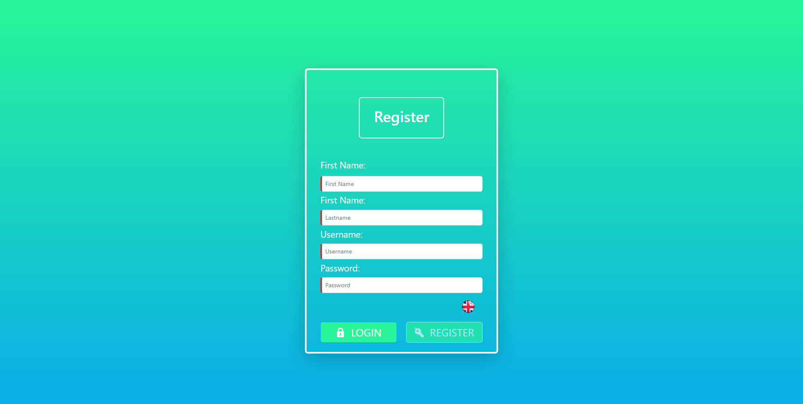
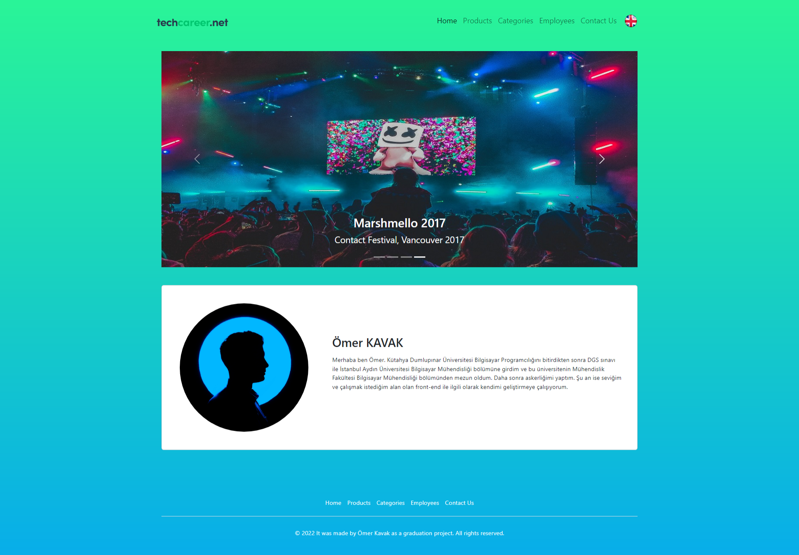
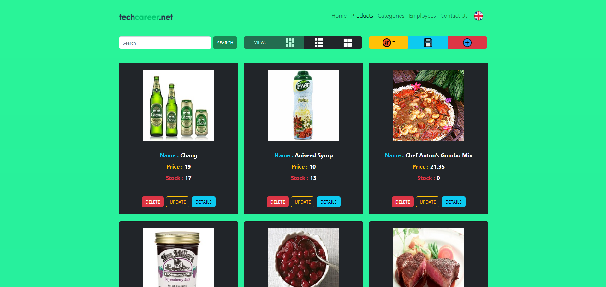
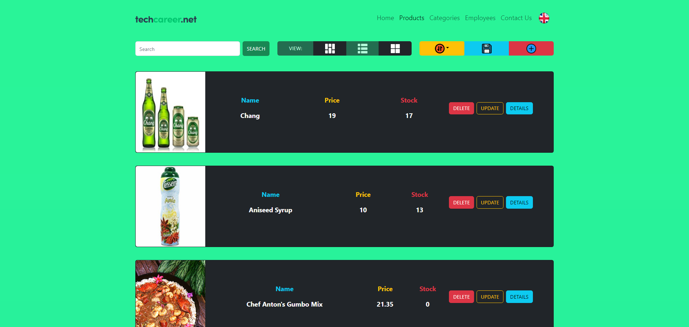
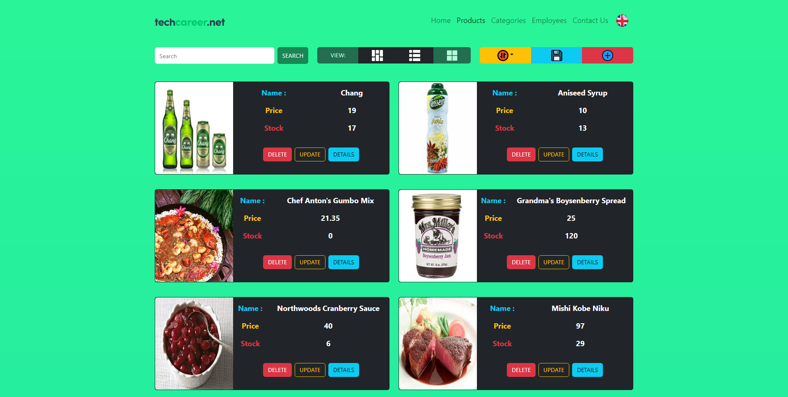
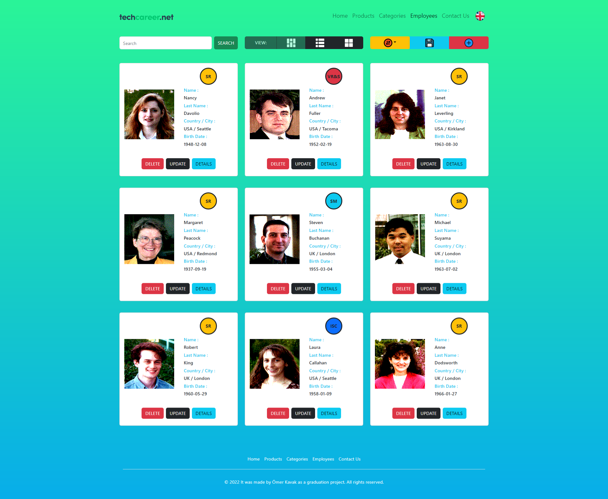
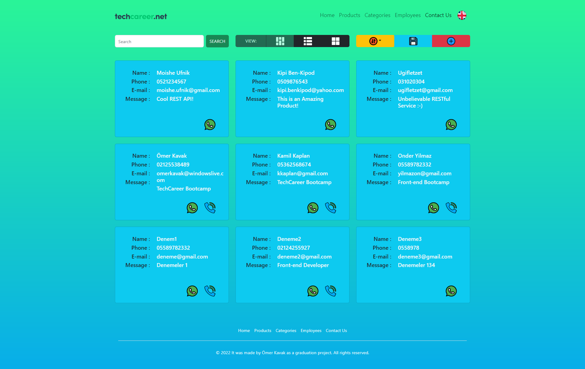

# Ömer Kavak
---
## Front-End Bootcamp with Angular Bitirme Projesi
---
##### Bu uygulama Angular CLI: 14.0.7 ile TechCareer Front-End Bootcamp sonunda bitirme projesi olarak geliştirilmiştir. Projenin backend tarafında Northwind-back-end node api paketi kullanılmıştır. Ayrıca Bootstap 5.2 versiyonu css kütüphanesi olarak tercih edilmiş ve kullanıcıla çeşitli bilgiler göstermek için gene bir node kütüphanesi olan toastr kullanılmıştır.


## Projenin Yerel Bilgisayarda Çalıştırılması 
---
##### Projenin yerel olarak çalıştırılması için ilk olarak gerekli olan node modüllerinin indirmelidir. Bunun için kullandığınız terminalde cd komutu kullanarak proje dosyalarının olduğu dizine gidilir. Daha sonra ``` npm install ``` yada ``` npm i ``` komutu ile proje için gerekli olan node modülleri indirilir. İndirme işlemleri bittikten sonra back-end işlemlerini yapmak için kullandığımız northwind-back-end node api modülünü çalıştırmamız gerekmektedir. Bunun için terminale ```northwind``` yazmamız yeterlidir. Bu api varsayılan olarak http://localhost:3030 adresinde 3030 portunda çalışır. Eğer bu portu kullanan bir uygulama varsa kapatılmalıdır. Aksi taktirde uygulamaya northwind api üzerinden çekilen verilere erişim sağlanamayacaktır. Northwind back-end api çalıştırıldıktan sonra yeni bir terminal açılıp ```ng serve ``` yapılırsa proje çalıştırılmış olur. Proje varsayılan olaarak http://localhost:4200 çalışır. Proje çalıştıktan sonra tarayacı da açılmaz. Proje çalıştırıldıktan sonra otomatik olarak tarayıcıda açılmasını istersek yazmamız gereken kod ```ng serve --open ``` veya ```ng serve -o``` olacaktır. Projenin varsayılan olarak açıldığı portu değiştirmek istersek yapmamız gereken kod ise ```ng serve -o --port=4000``` şeklinde istedimiz port numarasını yazıp projemizi istediğimiz porta çalıştırabiliriz.

## Projenin Yönetilebilirliğinin Sağlanması 
---
#### Proje mümküm olduğunca parçalara ayrılmıştır bu sayede projenin yönetilebilirliği artırılmıştır. Bunun için proje için oluşturulan bütün komponentler "components" klasörü altında oluşturulmuştur. Oluşturulan "interface" yani model dosyaları modals klasörü altında oluşturulmuştur. Back-end işlemleri için yazılan "service" dosyaları services adlı klasör altında oluşturulmuştur ve son olarak Angular'da verileri filtreleme ve dönüştürme için kullanılan "pipe" dosyaları pipes klasörü altında oluşturulmuştur.

# Projenin Dil Desteği 
---
#### Projenin arayüzünde iki dil kullanılmıştır. Bu dillerin sayfada görüntülenmesini sağlamak için "ngx-translate" modülü kullanılmıştır. Bu modülün kullanım şekli ise projenin içindeki "assets" klasörü altında "i18n" klasörü oluşturup içine  projemizin arayüzünde kullanacağımız dillerin olduğu ve değiştirmek istediğimiz alanlar için oluşturmamız gereken anahtarlar ve değerlerinin olduğu .json uzantılı dosyaların oluşturulması ve "ngx-translate" modülü sayesinde aynı angularda olduğu gibi json dosyasında tanımladğımız anahtar kelimelerin süslü paraztezler içinde arayüzde yazılıp translate pipe ile dil değişimleri sağlanarak kullanılır.

# Projede Kullanılan Componentler
---
##### -- AppComponent
##### -- NavbarComponent
##### -- HomeComponent
##### -- ProductsComponent
##### -- CategoriesComponent
##### -- EmployeesComponent
##### -- ContactusComponent
##### -- FooterComponent
##### -- LoginComponent
##### -- RegisterComponent


# Projede Kullanılan Moduller
---
##### -- BrowserModule,
##### -- ReactiveFormsModule,
##### -- FormsModule,
##### -- BrowserAnimationsModule,
##### -- AppRoutingModule,
##### -- HttpClientModule,
##### -- ToastrModule
##### -- TranslateModule 

# Projeden Ekran Görüntüleri
---


Resimler İçin Markup

### Giriş Sayfası


### Kayıt Ol Sayfası


### Anasayfa 


### Ürünler Sayfası / Görünüm Seçenekleri / Klasik Görünüm


### Ürünler Sayfası / Görünüm Seçenekleri / Liste Görünümü


### Ürünler Sayfası / Görünüm Seçenekleri / Galeri Görünümü


### Employees Page


### Contact Us Page
